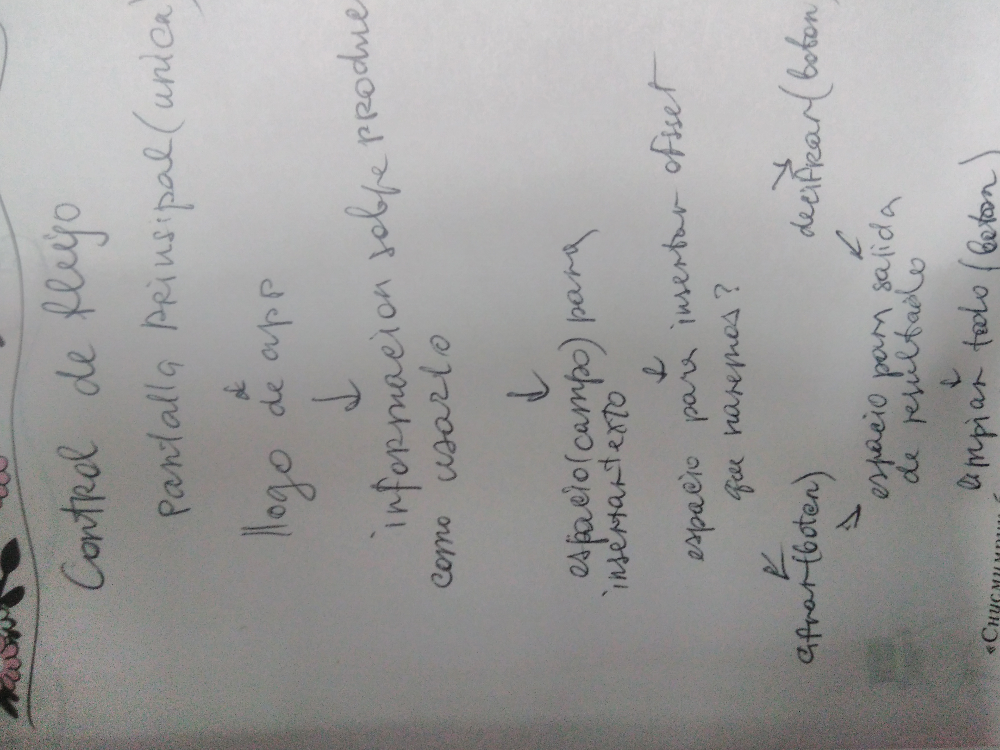
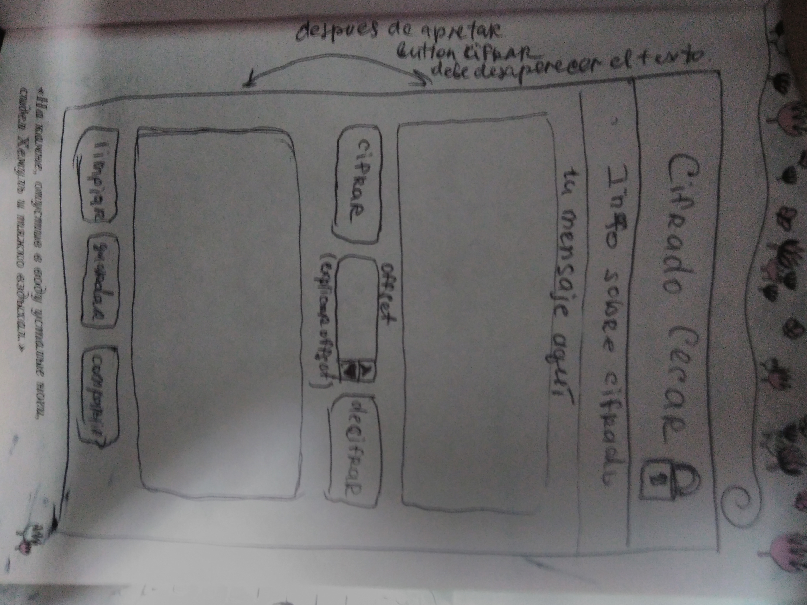
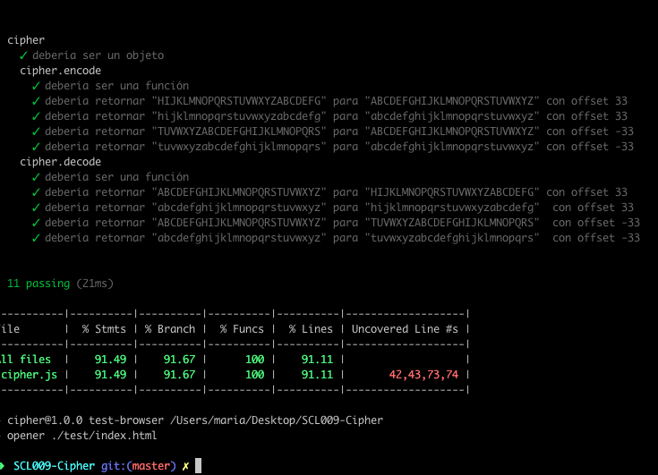

# Tus contraseñas con Cifrado Cesar
### Definicion de producto:
Es una **aplicacion para cifrar(y decifrar) las contarseñas**. La idea es que tu puedes inventar la contraseña que sea facil para recordarla y con la aplicación convertir en otra mas dificíl de decifrar. Pero no es necesario acoradar la nueva contraseña, solo tienes que saber el original y el desplazamiento que le pusiste.

Los **usuarios principales** son users de redes sociales, correos electronicos, cuentas bancarias etc.

### Como usarlo:
* Tiene que ir a este enlace:
[aqui](https://mariia1304.github.io/SCL009-Cipher/src/index.html)
* Listo! Ya puede usar el producto!

### Proceso y decisiones de diseño:
##### Definiciones de diseño:

 - El producto debe tener el campo para insertar el texto, campo para definir el offset campo para salida de texto ya cifrado y dos botones:cifrar y decifrar.(opcional: boton 'limpiar').Ademas diseño debe ser responsive(para despositivos moviles)
 - Control de flujo:
   
 - sketch:
   
 - para armar estructura de la app ocupo HTML5
 - Para darle estilo y responsive a la app ocupé CSS3,bootstrap 4.
 - Para funcionalidad vanilla JavaScript.
 - Hice tests de funcionalidad
     * los tests:
     
 
 
 
 
 